# 实验1

- [实验1](#实验1)
  - [一、android studio的安装](#一android-studio的安装)
  - [二、Anaconda安装](#二anaconda安装)
  - [三、作业-jupyter默认打开文件夹设置](#三作业-jupyter默认打开文件夹设置)

## 一、android studio的安装

1、首先，去非C盘新建文件夹 AndroidTool，并新建子目录AndroidProject和AndroidSDK方便以后的存放

2、去官网下载最新的android studio安装包 https://developer.android.google.cn/studio

3、下载完成后，一路next。

**注意：**最好将软件安装在非C盘中

4、等待安装

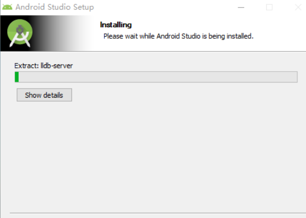

5、安装完成后，点击finish，等待启动。

**注意：**此时还没有安装SDK，SDK待会会自动安装。

6、启动成功，进入相关配置。

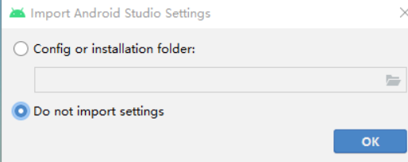

7、这里就是提示没有SDK，根据提示点击安装SDK。

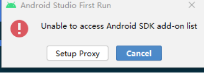

8、这里选择custom自定义安装。

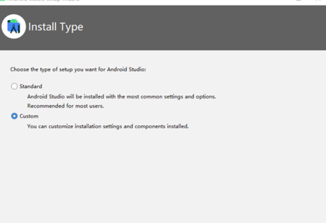

9、选择SDK存放目录

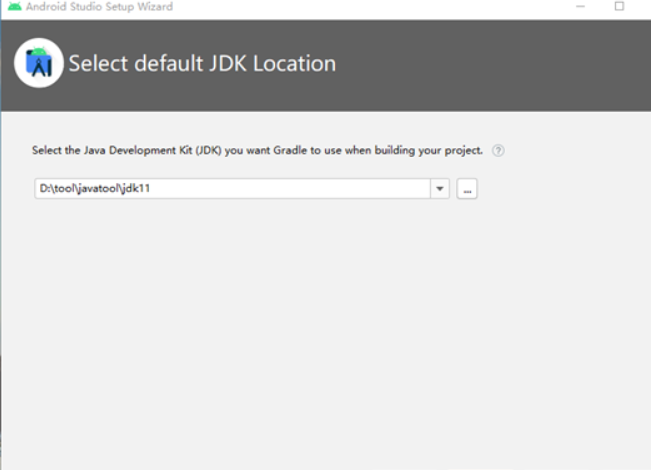

10、选择SDK安装，并分配空间。

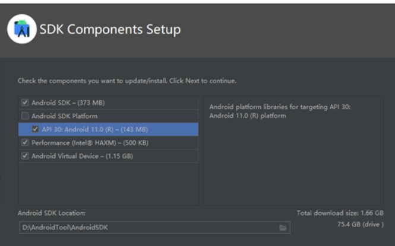

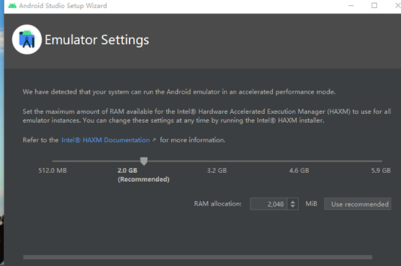

11、等待SDK安装完成。

创建新空白项目。

**第一次启动要下载很多东西，要慢慢等他下载完毕**

12、下载虚拟机，启动项目。

**也可以不下载，用数据线链接安卓/鸿蒙收集进行测试**

13、连接收集，测试成功。

## 二、Anaconda安装

1、进入官网：https://www.anaconda.com/ 下载最新版安装包

2、点击Products，选择Individual Edition，进行安装

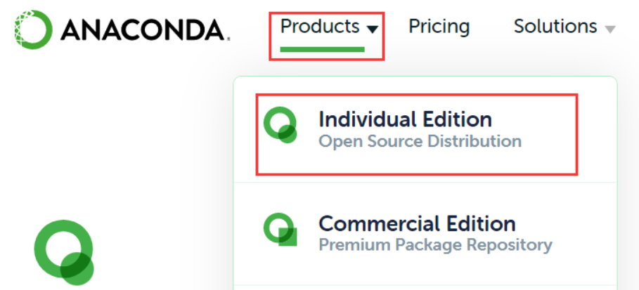

3、双击exe文件，进行安装

4、一路next

5、在非C盘新建Anaconda3文件夹，并在安装时选择将anaconda安装在指定文件夹中。

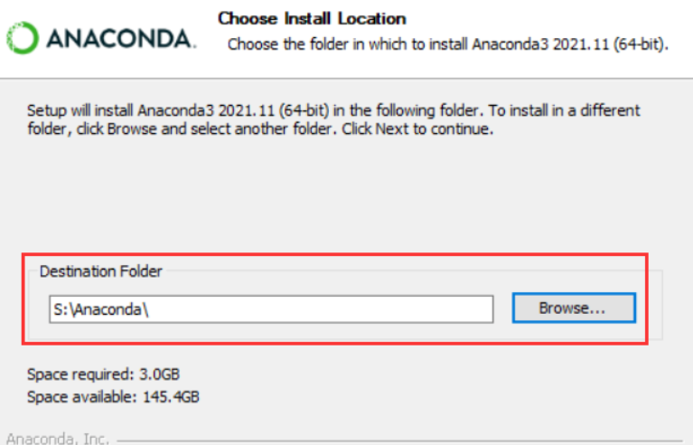

6、等待安装完成。

7、在**开始菜单 - 全部软件 - anaconda - 点击jupyter**，运行jupyter软件。

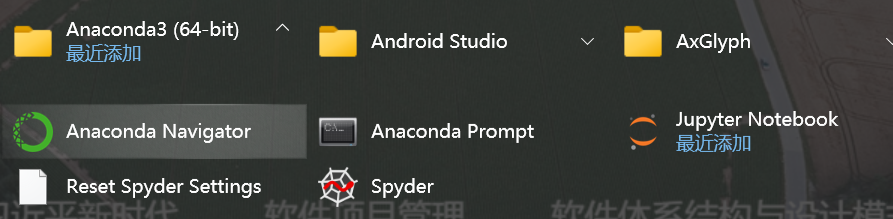

8、等待运行，安装完成！

## 三、作业-jupyter默认打开文件夹设置

1、菜单中打开Anaconda Prompt

2、输入命令 **jupyter notebook --generate-config**

3、根据上面运行处的路径打开**C:\Users\lei\\.jupyter\jupyter_notebook_config.py**文件

4、找到 **# c.NotebookApp.notebook_dir = ''**，去掉该行前面的“#”（注意：这行前面也不能有空格哦）；在打算存放文件的位置先新建一个文件夹（最好是英文的），然后将新的路径填在单引号中，保存配置文件

5、在开始菜单找到“Jupyte Notebook”快捷键，鼠标右击 -- 更多 -- 打开文件位置

6、找到对应的“Jupyte Notebook”快捷图标，鼠标右击 -- 属性 -- 目标，去掉后面的 "%USERPROFILE%/"（很重要），然后点击“应用”，“确定”　　

7、重新启动Jupyte Notebook即可

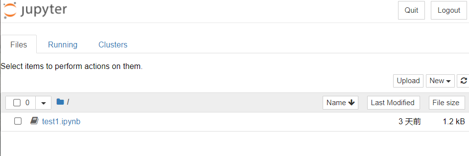

