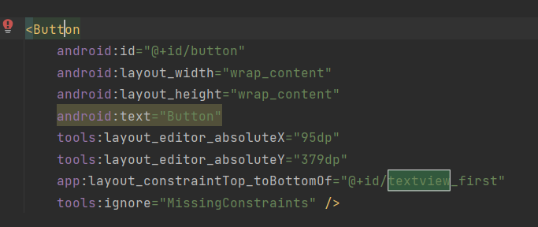
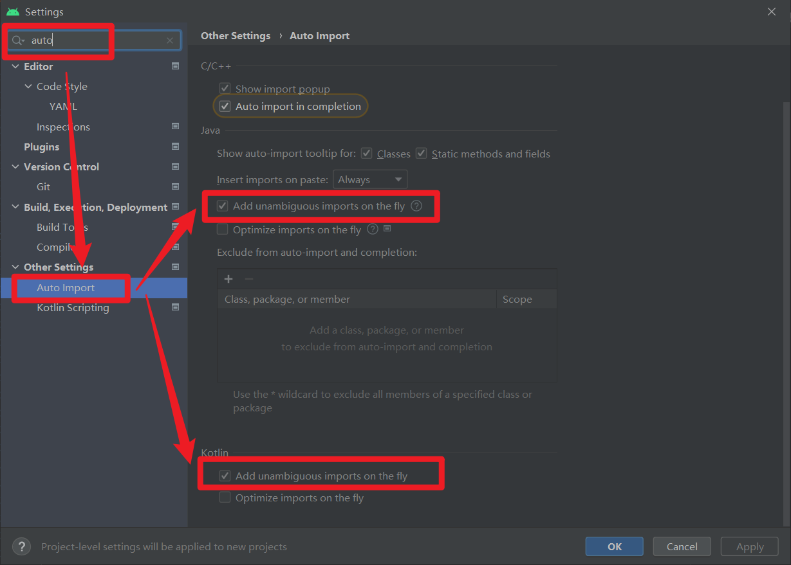

# 创建一个Android Kotlin应用

- [ 创建一个Android Kotlin应用](#实验二-创建一个android-kotlin应用)
  - [一、实验前的准备](#一实验前的准备)
  - [二、开始实验](#二开始实验)
    - [2.1 基础设置](#21-基础设置)
    - [2.2 添加Toast按钮](#22-添加toast按钮)
    - [2.3 添加Next按钮](#23-添加next按钮)
    - [2.4 添加Count按钮](#24-添加count按钮)
    - [2.5 完善UI组件的属性设置](#25-完善ui组件的属性设置)
    - [2.6 设置组件的位置](#26-设置组件的位置)
    - [2.7 设置代码自动补全](#27-设置代码自动补全)
    - [2.8 编写Kotlin逻辑代码](#28-编写kotlin逻辑代码)
    - [2.9 使Count按钮更新屏幕的数字](#29-使count按钮更新屏幕的数字)
    - [2.10 向界面添加TextView显示随机数](#210-向界面添加textview显示随机数)
    - [2.11 更新显示界面文本的TextView](#211-更新显示界面文本的textview)
    - [2.12 检查导航图](#212-检查导航图)
    - [2.13 启用SafeArgs](#213-启用safeargs)
    - [2.14 创建导航动作的参数](#214-创建导航动作的参数)
    - [2.15 FirstFragment添加代码，向SecondFragment发数据](#215-firstfragment添加代码向secondfragment发数据)
    - [2.16 添加SecondFragment的代码](#216-添加secondfragment的代码)
  - [三、结果展示](#三结果展示)


## 一、实验前的准备

1、创建一个新的工程 

注意：这里要选择 **Basic Activity**；

​      	而且要选择使用 **koltin** 语言；

​			尽量选择**较新的API Level**创建应用程序；

2、创建完后，直接点击运行，让项目先跑起来，出现下图的应用界面；


3、熟悉android studio编辑器的相关页面相关。

主要是熟悉 **kotlin逻辑代码区域** 和 **页面相关组件配置区域** ，如下图。

<font color='red'>注意： 之后的所有有关界面的组件布局设置，都不要用鼠标直接拖动！！ 会产生偏移</font>


## 二、开始实验

### 2.1 基础设置

1、在Basic Activity中，包含了基本的导航组件，Android app关联两个[fragments](https://developer.android.google.cn/guide/components/fragments)，第一个屏幕显示了“Hello first fragment”由**FirstFragment**创建，界面元素的排列由布局文件指定，查看res>layout>fragment_first.xml，

2、修改Textview的相关属性配置：

修改后的相关代码如下所示：

```xml
<TextView
        android:id="@+id/textview_first"
        android:layout_width="wrap_content"
        android:layout_height="wrap_content"
        android:fontFamily="sans-serif-condensed"
        app:layout_constraintVertical_bias="0.3"


        android:text="@string/hello_first_fragment"
        android:textColor="@android:color/darker_gray"
        android:textSize="30sp"
        android:textStyle="bold"

        app:layout_constraintBottom_toTopOf="@id/random_button"
        app:layout_constraintEnd_toEndOf="parent"
        app:layout_constraintStart_toStartOf="parent"
        app:layout_constraintTop_toTopOf="parent" />
```

### 2.2 添加Toast按钮

3、添加按钮和约束

从Palette面板中拖动Button到页面中，并设置button的约束：

```xml
app:layout_constraintTop_toBottomOf="@+id/textview_first" />
```

拖动button到页面中后，他会自动在xml下添加相关代码




随后添加Button的左侧约束至屏幕的左侧，Button的底部约束至屏幕的底部。查看Attributes面板，修改将id从button修改为toast_button（注意修改id将重构代码）


4、调整Next按钮，添加新的约束

首先，删除next按钮和textview之间的约束**（要双向删除）**

5、更改组件的文本显示

fragment_first.xml布局文件代码中，找到toast_button按钮的text属性部分

**这里text的赋值是一种硬编码，点击文本，左侧出现灯泡状的提示，选择 Extract string resource。**


弹出对话框，令资源名为toast_button_text，资源值为Toast，并点击OK。

### 2.3 添加Next按钮

在属性面板中更改Next按钮的id，从button_first改为random_button。


在string.xml文件，右键**next**字符串资源，选择 **Refactor > Rename**，修改资源名称为**random_button_text**，点击**Refactor** 。随后，修改**Next**值为**Random**。

### 2.4 添加Count按钮

向fragment_first.xml文件中添加第三个按钮，位于Toast和Random按钮之间，TextView的下方。新Button的左右约束分别约束至Toast和Random，Top约束至TextView的底部，Buttom约束至屏幕的底部，看起来的效果：


<font color='red'>注意： 检查xml代码，确保不出现类似app:layout_constraintVertical_bias这样的属性，即不手动设置偏移量。在上面提醒过！</font>

### 2.5 完善UI组件的属性设置

1、更改新增按钮id为**count_button**，显示字符串为**Count**，对应字符串资源值为**count_button_text**。于是三个按钮的text和id属性如下表：

| Button        | text   | id                 |
| ------------- | ------ | ------------------ |
| Left button   | Toast  | @+id/toast_button  |
| Middle button | Count  | @+id/count_button  |
| Right button  | Random | @+id/random_button |

同时，更改TextView的文本为**0**。修改后的fragment_first.xml的代码：

```xml
<?xml version="1.0" encoding="utf-8"?>
<androidx.constraintlayout.widget.ConstraintLayout xmlns:android="http://schemas.android.com/apk/res/android"
    xmlns:app="http://schemas.android.com/apk/res-auto"
    xmlns:tools="http://schemas.android.com/tools"
    android:layout_width="match_parent"
    android:layout_height="match_parent"
    android:background="@color/screenBackground"

    tools:context=".FirstFragment">

    <TextView
        android:id="@+id/textview_first"
        android:layout_width="wrap_content"
        android:layout_height="wrap_content"
        android:fontFamily="sans-serif-condensed"
        app:layout_constraintVertical_bias="0.3"


        android:text="@string/hello_first_fragment"
        android:textColor="@android:color/darker_gray"
        android:textSize="30sp"
        android:textStyle="bold"

        app:layout_constraintBottom_toTopOf="@id/random_button"
        app:layout_constraintEnd_toEndOf="parent"
        app:layout_constraintStart_toStartOf="parent"
        app:layout_constraintTop_toTopOf="parent" />
    <Button
        android:id="@+id/random_button"
        android:layout_width="wrap_content"
        android:layout_height="wrap_content"
        android:layout_marginEnd="24dp"
        android:background="@color/buttonBackground"

        android:text="@string/random_button_text"
        app:layout_constraintBottom_toBottomOf="parent"
        app:layout_constraintEnd_toEndOf="parent"
        app:layout_constraintTop_toBottomOf="@+id/textview_first" />

    <Button
        android:id="@+id/toast_button"
        android:layout_width="wrap_content"
        android:layout_height="wrap_content"
        android:layout_marginStart="24dp"
        android:background="@color/buttonBackground"

        android:text="@string/toast_button_text"
        app:layout_constraintBottom_toBottomOf="parent"
        app:layout_constraintStart_toStartOf="parent"
        app:layout_constraintTop_toBottomOf="@+id/textview_first" />

    <Button
        android:id="@+id/count_button"
        android:layout_width="wrap_content"
        android:layout_height="wrap_content"
        android:text="@string/count_button_text"
        android:background="@color/buttonBackground"

        app:layout_constraintBottom_toBottomOf="parent"
        app:layout_constraintEnd_toStartOf="@+id/random_button"
        app:layout_constraintStart_toEndOf="@+id/toast_button"
        app:layout_constraintTop_toBottomOf="@+id/textview_first" />

</androidx.constraintlayout.widget.ConstraintLayout>
```

2、添加新的颜色资源并设置组件的外观

添加新颜色screenBackground 值为 #2196F3，这是蓝色阴影色；添加新颜色buttonBackground 值为 #BBDEFB到colors.xml

```xml
<color name="screenBackground">#2196F3</color>
<color name="buttonBackground">#BBDEFB</color>
```

fragment_first.xml的属性面板中设置屏幕背景色为

设置每个按钮的背景色为**buttonBackground**

```xml
android:background="@color/screenBackground"
android:background="@color/buttonBackground"
```


### 2.6 设置组件的位置

Toast与屏幕的左边距设置为24dp，Random与屏幕的右边距设置为24dp，利用属性面板的Constraint Widget完成设置。


设置TextView的垂直偏移为0.3，

```xml
app:layout_constraintVertical_bias="0.3"
```


### 2.7 设置代码自动补全

Android Studio中，依次点击File>New Projects Settings>Settings for New Projects…，查找Auto Import选项，在Java和Kotlin部分，勾选**Add Unambiguous Imports on the fly**。




### 2.8 编写Kotlin逻辑代码

打开FirstFragment.kt文件，有三个方法：onCreateView，onViewCreated和onDestroyView，在onViewCreated方法中使用绑定机制设置按钮的响应事件（创建应用程序时自带的按钮）。

```kotlin
binding.randomButton.setOnClickListener {
    findNavController().navigate(R.id.action_FirstFragment_to_SecondFragment)
}
```

==<font color='red'>**----注意：----**</font>==

此时如果直接跑，会报错。

因为原来button的名字已经被改了，所以**必须这边手动改一下方法名**！！


```kotlin
override fun onViewCreated(view: View, savedInstanceState: Bundle?) {
        super.onViewCreated(view, savedInstanceState)

//      binding.firstButton.setOnClickListener {
        binding.randomButton.setOnClickListener {
            findNavController().navigate(R.id.action_FirstFragment_to_SecondFragment)
        }
    }
```

==<font color='red'>**----end----**</font>==

接下来，为TOAST按钮添加事件，使用**findViewById()**查找按钮id，代码如下：

```xml
// find the toast_button by its ID and set a click listener
view.findViewById<Button>(R.id.toast_button).setOnClickListener {
   // create a Toast with some text, to appear for a short time
   val myToast = Toast.makeText(context, "Hello Toast!", Toast.LENGTH_LONG)
   // show the Toast
   myToast.show()
}
```

### 2.9 使Count按钮更新屏幕的数字

此步骤向Count按钮添加事件响应，更新Textview的文本显示。
在FirstFragment.kt文件，为count_buttion按钮添加事件：

```kotlin
view.findViewById<Button>(R.id.count_button).setOnClickListener {
   countMe(view)
}

```

countMe()为自定义方法，以View为参数，每次点击增加数字1，具体代码为：

```kotlin
private fun countMe(view: View) {
   // Get the text view
   val showCountTextView = view.findViewById<TextView>(R.id.textview_first)

   // Get the value of the text view.
   val countString = showCountTextView.text.toString()

   // Convert value to a number and increment it
   var count = countString.toInt()
   count++

   // Display the new value in the text view.
   showCountTextView.text = count.toString()
}

```

### 2.10 向界面添加TextView显示随机数

此步骤将完成按照First Fragment显示数字作为上限，随机在Second Fragment上显示一个数字，即Random按钮的事件响应。

1. 打开fragment_second.xml的设计视图中，当前界面有两个组件，一个Button和一个TextView（textview_second）。
2. 去掉TextView和Button之间的约束
3. 拖动新的TextView至屏幕的中间位置，用来显示随机数
4. 设置新的TextView的id为**@+id/textview_random**
5. 设置新的TextView的左右约束至屏幕的左右侧，Top约束至textview_second的Bottom，Bottom约束至Button的Top
6. 设置TextView的字体颜色textColor属性为**@android:color/white**，**textSize**为**72sp**，**textStyle**为**bold**
7. 设置TextView的显示文字为“**R**”
8. 设置垂直偏移量**layout_constraintVertical_bias**为0.45


最终修改完成的第二个页面的xml代码如下：

```xml
<?xml version="1.0" encoding="utf-8"?>
<androidx.constraintlayout.widget.ConstraintLayout xmlns:android="http://schemas.android.com/apk/res/android"
    xmlns:app="http://schemas.android.com/apk/res-auto"
    xmlns:tools="http://schemas.android.com/tools"
    android:layout_width="match_parent"
    android:layout_height="match_parent"
    android:background="@color/screenBackground2"
    tools:context=".SecondFragment">

    <TextView
        android:id="@+id/textview_header"
        android:layout_width="0dp"
        android:layout_height="wrap_content"
        android:layout_marginStart="24dp"
        android:layout_marginLeft="24dp"
        android:layout_marginTop="24dp"
        android:layout_marginEnd="24dp"
        android:layout_marginRight="24dp"
        android:text="@string/random_heading"
        android:textColor="@color/colorPrimaryDark"
        android:textSize="24sp"
        app:layout_constraintEnd_toEndOf="parent"
        app:layout_constraintStart_toStartOf="parent"
        app:layout_constraintTop_toTopOf="parent" />


    <Button
        android:id="@+id/button_second"
        android:layout_width="wrap_content"
        android:layout_height="wrap_content"
        android:text="@string/previous"
        app:layout_constraintBottom_toBottomOf="parent"
        app:layout_constraintEnd_toEndOf="parent"
        app:layout_constraintStart_toStartOf="parent" />

    <TextView
        android:id="@+id/textview_random"
        android:layout_width="wrap_content"
        android:layout_height="wrap_content"
        android:text="R"
        android:textColor="@android:color/white"
        android:textSize="72sp"
        android:textStyle="bold"
        app:layout_constraintBottom_toTopOf="@+id/button_second"
        app:layout_constraintEnd_toEndOf="parent"
        app:layout_constraintStart_toStartOf="parent"
        app:layout_constraintTop_toBottomOf="@+id/textview_header"
        app:layout_constraintVertical_bias="0.45" />

</androidx.constraintlayout.widget.ConstraintLayout>
```

### 2.11 更新显示界面文本的TextView

1. 在fragment_second.xml文件中，选择textview_second文本框，查看text属性

   ```xml
   android:text="@string/hello_second_fragment
   ```

2. 更改该文本框id为textview_header

3. 设置layout_width为**match_parent**，layout_height为**wrap_content**。

4. 设置top，left和right的margin为24dp，左边距和右边距也就是start和end边距。

5. 若还存在与Button的约束，则删除。

6. 向colors.xml添加颜色colorPrimaryDark，并将TextView颜色设置为@color/colorPrimaryDark，字体大小为**24sp**。

   ```xml
   <color name="colorPrimaryDark">#3700B3</color>
   ```

7. strings.xml文件中，修改`hello_second_fragment`的值为"`Here is a random number between 0 and %d.`"

8. 使用**Refactor>Rename**将`hello_second_fragment` 重构为`random_heading`

```xml
<TextView
        android:id="@+id/textview_header"
        android:layout_width="0dp"
        android:layout_height="wrap_content"
        android:layout_marginStart="24dp"
        android:layout_marginLeft="24dp"
        android:layout_marginTop="24dp"
        android:layout_marginEnd="24dp"
        android:layout_marginRight="24dp"
        android:text="@string/random_heading"
        android:textColor="@color/colorPrimaryDark"
        android:textSize="24sp"
        app:layout_constraintEnd_toEndOf="parent"
        app:layout_constraintStart_toStartOf="parent"
        app:layout_constraintTop_toTopOf="parent" />
```

更改界面的背景色和按钮布局

```xml
<color name="screenBackground2">#26C6DA</color>
```


修改完的第二个页面的布局如图所示：


### 2.12 检查导航图

本项目选择Android的Basic Activity类型进行创建，默认情况下自带两个Fragments，并使用Android的导航机制[Navigation](https://developer.android.com/guide/navigation/navigation-getting-started)。导航将使用按钮在两个Fragment之间进行跳转，就第一个Fragment修改后的Random按钮和第二个Fragment的Previous按钮。

打开nav_graph.xml文件（**res>navigation>nav_graph.xml**），形如：

### 2.13 启用SafeArgs

1. 首先打开 **Gradle Scripts > build.gradle (Project: My First App)**

2. Gradle的Project部分，在plugins节添加

   ```xml
   id 'androidx.navigation.safeargs.kotlin' version '2.5.0-alpha01' apply false
   ```

3. 接着打开 **Gradle Scripts > build.gradle (Module: app)**

4. module部分在plugins节添加一行

   ```xml
   id 'androidx.navigation.safeargs'
   ```

5. Android Studio开始同步依赖库

6. 重新生成工程**Build > Make Project**

### 2.14 创建导航动作的参数

1. 打开导航视图，点击`FirstFragment`，查看其属性。
2. 在`Actions`栏中可以看到导航至`SecondFragment`
3. 同理，查看`SecondFragment`的属性栏
4. 点击Arguments **+**符号
5. 弹出的对话框中，添加参数myArg，类型为整型Integer

### 2.15 FirstFragment添加代码，向SecondFragment发数据

1. 打开FirstFragment.kt源代码文件找到onViewCreated()方法，该方法在onCreateView方法之后被调用，可以实现组件的初始化。

2. 找到Random按钮的响应代码，注释掉原先的事件处理代码

3. 实例化TextView，获取TextView中文本并转换为整数值

   ```xml
   val showCountTextView = view.findViewById<TextView>(R.id.textview_first)
   val currentCount = showCountTextView.text.toString().toInt()
   ```

4. 将`currentCount`作为参数传递给actionFirstFragmentToSecondFragment()

5. 添加导航事件代码

   ```xml
   findNavController().navigate(action)
   ```


### 2.16 添加SecondFragment的代码

1. 导入navArgs包

```kotlin
import androidx.navigation.fragment.navArgs
```

2. onViewCreated()`代码之前添加一行

```kotlin
val args: SecondFragmentArgs by navArgs()
```

3.`onViewCreated()`中获取传递过来的参数列表，提取count数值，并在textview_header中显示

```kotlin
val count = args.myArg
val countText = getString(R.string.random_heading, count)
view.findViewById<TextView>(R.id.textview_header).text = countText
```

4.根据count值生成随机数

```kotlin
val random = java.util.Random()
var randomNumber = 0
if (count > 0) {
   randomNumber = random.nextInt(count + 1)
}
```

5.textview_random中显示count值

```kotlin
view.findViewById<TextView>(R.id.textview_random).text = randomNumber.toString()
```

6.运行应用程序，查看运行结果。


## 三、结果展示

1、启动应用


2、点击count几次


3、点击random按钮


*注：可以看到这边跳转到第二个页面的显示的是 **0-4** 符合第一个页面的限制范围。*


