# 基于TensorFlow Lite实现的Android花卉识别应用

- [一、项目准备](#一项目准备)
- [二、运行](#二运行)
- [三、向应用中添加TensorFlow Lite](#三向应用中添加tensorflow-lite)
- [四、检查代码中的TODO项](#四检查代码中的todo项)
- [五、添加代码重新运行APP](#五添加代码重新运行app)
- [六、最终结果](#六最终结果)


## 一、项目准备

为节省时间，从github上下载训练好的模型：

```bash
git clone https://github.com/hoitab/TFLClassify.git
```


## 二、运行

1 打开Android Studio，选择“Open an Existing Project"

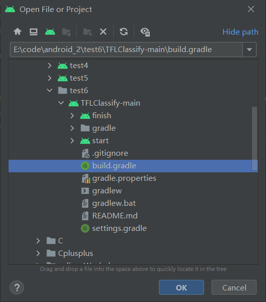

2 选择TFLClassify/build.gradle生成整个项目。

​       **可能会同步失败，需要去project structure修改版本号：**

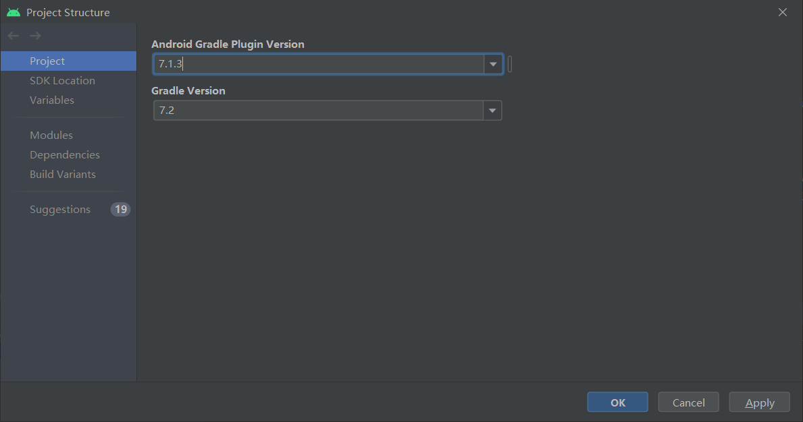

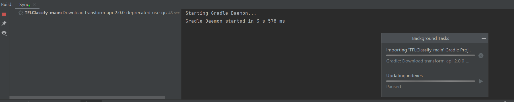

然后等待完成

3 项目包含两个module：finish 和 start，finish模块是已经完成的项目，start则是本项目实践的模块。

第一次编译项目时，弹出“Gradle Sync”，将下载相应的gradle wrapper

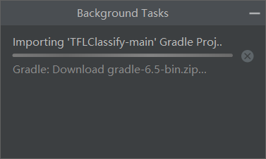

手机通过USB接口连接开发平台，并设置手机开发者选项允许调试。	

选择真实物理机（而不是模拟器）运行start模块

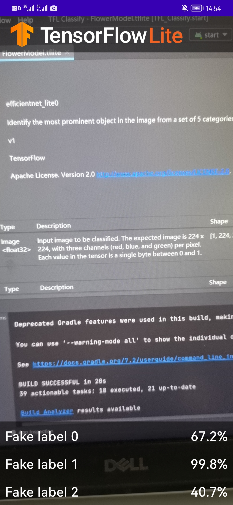

## 三、向应用中添加TensorFlow Lite

1 右键“start”模块，或者选择File，然后New>Other>TensorFlow Lite Mode

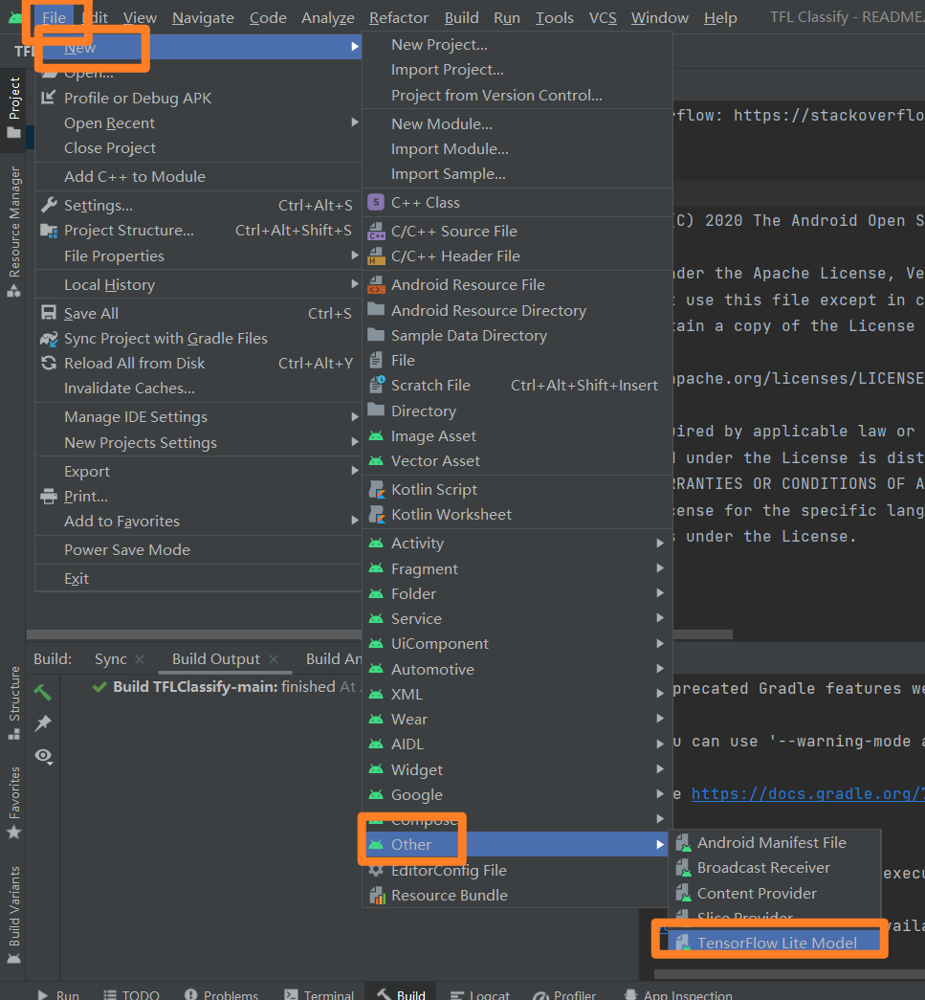


2 选择已经下载的自定义的训练模型。本教程模型训练任务以后完成，这里选择finish模块中ml文件下的FlowerModel.tflite。

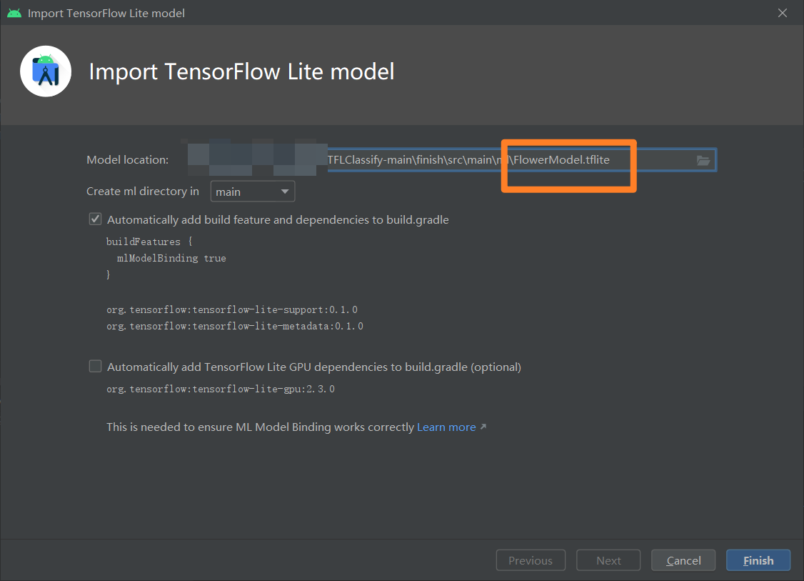

点击“Finish”完成模型导入，系统将自动下载模型的依赖包并将依赖项添加至模块的build.gradle文件。

3 最终TensorFlow Lite模型被成功导入，并生成摘要信息

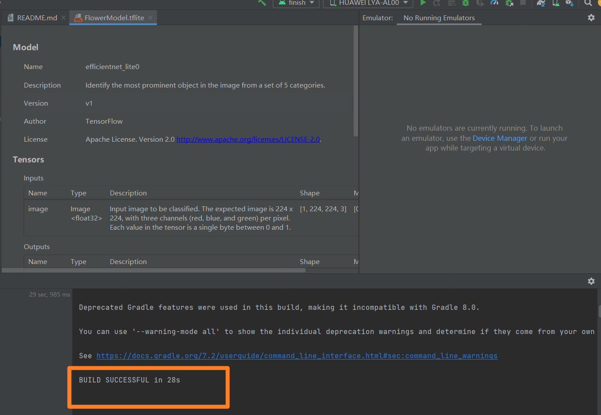

## 四、检查代码中的TODO项

本项目初始代码中包括了若干的TODO项，以导航项目中未完成之处。为了方便起见，首先查看TODO列表视图，View>Tool Windows>TODO

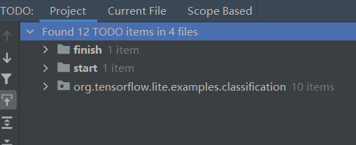


## 五、添加代码重新运行APP

1 定位“start”模块**MainActivity.kt**文件的TODO 1，添加初始化训练模型的代码

```kotlin
private class ImageAnalyzer(ctx: Context, private val listener: RecognitionListener) :
        ImageAnalysis.Analyzer {

        // TODO 1: Add class variable TensorFlow Lite Model
        private val flowerModel = FlowerModel.newInstance(ctx)
```

2、在CameraX的analyze方法内部，需要将摄像头的输入`ImageProxy`转化为`Bitmap`对象，并进一步转化为`TensorImage` 对象

```ko
 override fun analyze(imageProxy: ImageProxy) {

            val items = mutableListOf<Recognition>()

            // TODO 2: Convert Image to Bitmap then to TensorImage
            val tfImage = TensorImage.fromBitmap(toBitmap(imageProxy))
```

3、对图像进行处理并生成结果，主要包含下述操作：

- 按照属性`score`对识别结果按照概率从高到低排序
- 列出最高k种可能的结果，k的结果由常量`MAX_RESULT_DISPLAY`定义

```k
// TODO 3: Process the image using the trained model, sort and pick out the top results
  val outputs = flowerModel.process(tfImage)
      .probabilityAsCategoryList.apply {
          sortByDescending { it.score } // Sort with highest confidence first
      }.take(MAX_RESULT_DISPLAY) // take the top results
```

4、将识别的结果加入数据对象`Recognition` 中，包含`label`和`score`两个元素。后续将用于`RecyclerView`的数据显示

```ko
  // TODO 4: Converting the top probability items into a list of recognitions
  for (output in outputs) {
      items.add(Recognition(output.label, output.score))
  }
```

5、将原先用于虚拟显示识别结果的代码注释掉或者删除

```k
// START - Placeholder code at the start of the codelab. Comment this block of code out.
for (i in 0..MAX_RESULT_DISPLAY-1){
    items.add(Recognition("Fake label $i", Random.nextFloat()))
}
// END - Placeholder code at the start of the codelab. Comment this block of code out.
```

6、修改完最终的 ImageAnalyzer 类的代码如下：

```kotlin
private class ImageAnalyzer(ctx: Context, private val listener: RecognitionListener) :
        ImageAnalysis.Analyzer {

        // TODO 1: Add class variable TensorFlow Lite Model
        private val flowerModel = FlowerModel.newInstance(ctx)
        override fun analyze(imageProxy: ImageProxy) {

            val items = mutableListOf<Recognition>()

            // TODO 2: Convert Image to Bitmap then to TensorImage
            val tfImage = TensorImage.fromBitmap(toBitmap(imageProxy))


            // TODO 3: Process the image using the trained model, sort and pick out the top results
            val outputs = flowerModel.process(tfImage)
                .probabilityAsCategoryList.apply {
                    sortByDescending { it.score } // Sort with highest confidence first
                }.take(MAX_RESULT_DISPLAY) // take the top results


            // TODO 4: Converting the top probability items into a list of recognitions
            for (output in outputs) {
                items.add(Recognition(output.label, output.score))
            }


            // START - Placeholder code at the start of the codelab. Comment this block of code out.
//            for (i in 0 until MAX_RESULT_DISPLAY){
//                items.add(Recognition("Fake label $i", Random.nextFloat()))
//            }

            // START - Placeholder code at the start of the codelab. Comment this block of code out.
            for (i in 0..MAX_RESULT_DISPLAY-1){
                items.add(Recognition("Fake label $i", Random.nextFloat()))
            }

            // END - Placeholder code at the start of the codelab. Comment this block of code out.

            // END - Placeholder code at the start of the codelab. Comment this block of code out.

            // Return the result
            listener(items.toList())

            // Close the image,this tells CameraX to feed the next image to the analyzer
            imageProxy.close()
        }

        /**
         * Convert Image Proxy to Bitmap
         */
        private val yuvToRgbConverter = YuvToRgbConverter(ctx)
        private lateinit var bitmapBuffer: Bitmap
        private lateinit var rotationMatrix: Matrix

        @SuppressLint("UnsafeExperimentalUsageError")
        private fun toBitmap(imageProxy: ImageProxy): Bitmap? {

            val image = imageProxy.image ?: return null

            // Initialise Buffer
            if (!::bitmapBuffer.isInitialized) {
                // The image rotation and RGB image buffer are initialized only once
                Log.d(TAG, "Initalise toBitmap()")
                rotationMatrix = Matrix()
                rotationMatrix.postRotate(imageProxy.imageInfo.rotationDegrees.toFloat())
                bitmapBuffer = Bitmap.createBitmap(
                    imageProxy.width, imageProxy.height, Bitmap.Config.ARGB_8888
                )
            }

            // Pass image to an image analyser
            yuvToRgbConverter.yuvToRgb(image, bitmapBuffer)

            // Create the Bitmap in the correct orientation
            return Bitmap.createBitmap(
                bitmapBuffer,
                0,
                0,
                bitmapBuffer.width,
                bitmapBuffer.height,
                rotationMatrix,
                false
            )
        }

    }
```

## 六、最终结果

使用物理设备连接进行调试，以**玫瑰花**、**菊花**为例：

**玫瑰花**

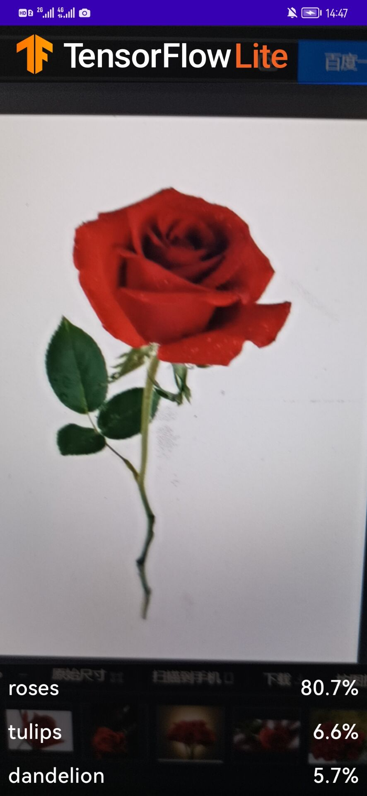

**菊花**

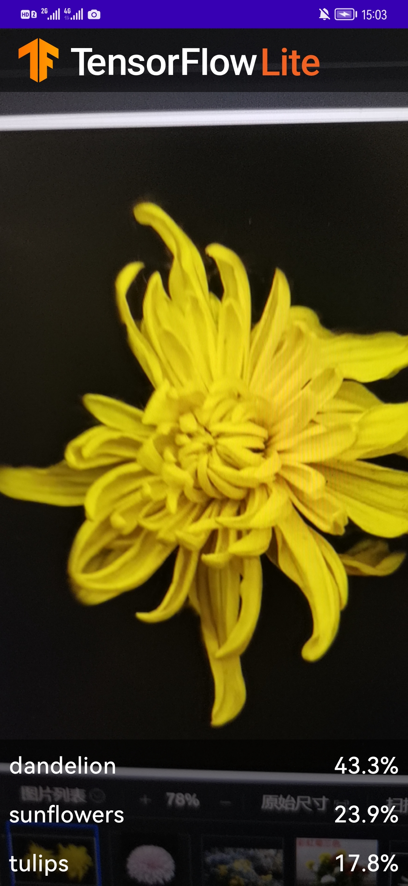


