# Jupyter Notebook基础教程

  - [一、Jupyter Notebook简介](#一jupyter-notebook简介)
  - [二、创建一个新的Notebook](#二创建一个新的notebook)
  - [三、数据分析的例子](#三数据分析的例子)
  - [四、使用matplotlib进行绘图](#四使用matplotlib进行绘图)
  - [五、分享Notebooks](#五分享notebooks)
    - [分享之前的工作](#分享之前的工作)
    - [导出Notebooks](#导出notebooks)
    - [Jupyter Notebook扩展工具](#jupyter-notebook扩展工具)


## 一、Jupyter Notebook简介

最好先安装Anaconda，Anaconda 中自带一个Jupyter的版本。

且使用Anaconda可以方便的安装python的一些包。

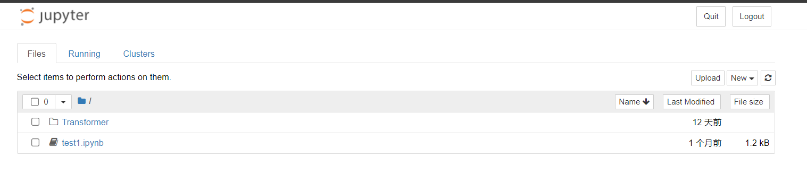

## 二、创建一个新的Notebook

新建一个Notebook Python 3 (ipykernel)，生成了一个`Untitled.ipynb`文件。`.ipynb`文件即所谓的一个Notebook，实际是基于JSON格式的文本文件，并且包含元数据(“Edit > Edit Notebook Metadata”)。新建的Notebook的界面大致如下：


**Kenel**

每个notebook都基于一个内核运行，当执行cell代码时，代码将在内核当中运行，运行的结果会显示在页面上。Kernel中运行的状态在整个文档中是延续的，可以跨越所有的cell。这意思着在一个Notebook某个cell定义的函数或者变量等，在其他cell也可以使用。


## 三、数据分析的例子

导入相关工具库：

```python
%matplotlib inline
import pandas as pd
import matplotlib.pyplot as plt
import seaborn as sns

```

加载数据集：

```python
df = pd.read_csv('fortune500.csv')
```

使用df.head()方法查看数据表的前5个元素：

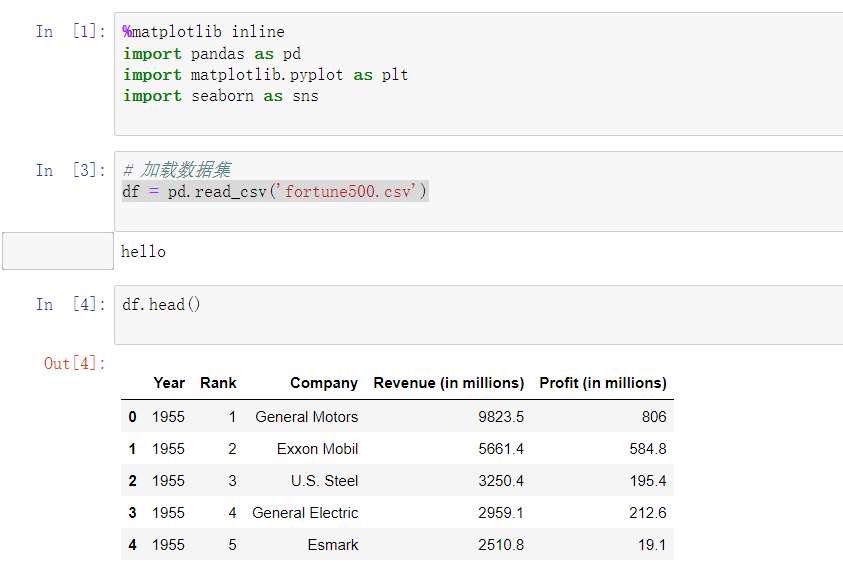

使用df.tail()方法查看数据表的前5个元素：

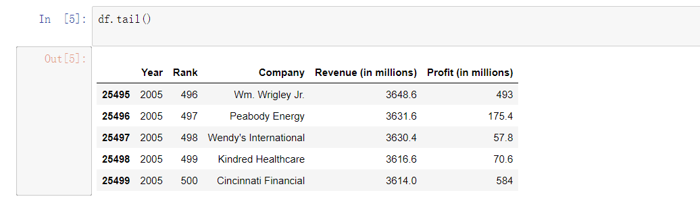

对数据属性列进行重命名，以便在后续访问

```python
df.columns = ['year', 'rank', 'company', 'revenue', 'profit']
```

接下来，检查数据条目是否加载完整, 检查属性列的类型。

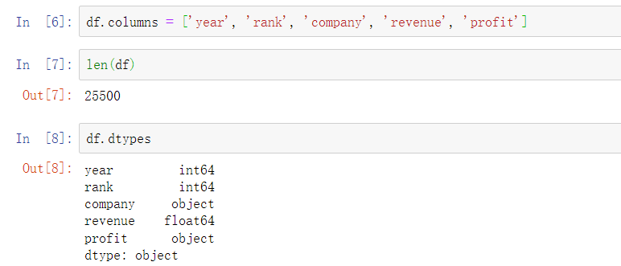

其他属性列都正常，但是对于profit属性，期望的结果是float类型，因此其可能包含非数字的值，利用正则表达式进行检查。

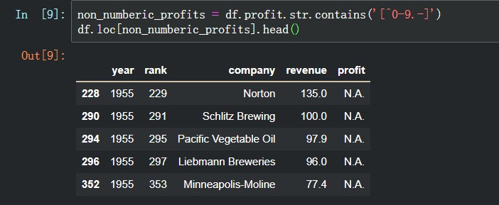

确实存在这样的记录，profit这一列为字符串，统计一下到底存在多少条这样的记录。

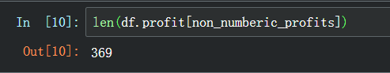

总体来说，利润（profit）列包含非数字的记录相对来说较少。更进一步，使用直方图显示一下按照年份的分布情况。

```
bin_sizes, _, _ = plt.hist(df.year[non_numberic_profits], bins=range(1955, 2006))
```

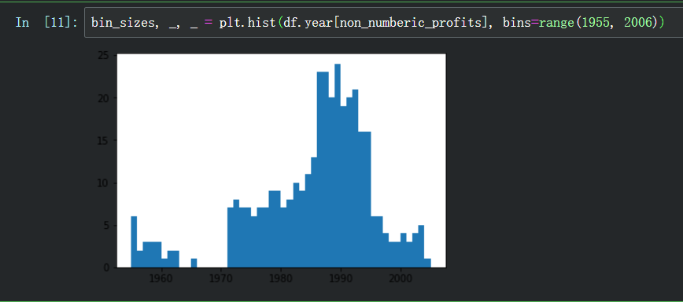

可见，单独年份这样的记录数都少于25条，即少于4%的比例。这在可以接受的范围内，因此删除这些记录。

```python
df = df.loc[~non_numberic_profits]
df.profit = df.profit.apply(pd.to_numeric)

```

再次检查数据记录的条目数。

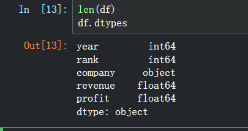

## 四、使用matplotlib进行绘图

接下来，以年分组绘制平均利润和收入。首先定义变量和方法。

```python
group_by_year = df.loc[:, ['year', 'revenue', 'profit']].groupby('year')
avgs = group_by_year.mean()
x = avgs.index
y1 = avgs.profit
def plot(x, y, ax, title, y_label):
    ax.set_title(title)
    ax.set_ylabel(y_label)
    ax.plot(x, y)
    ax.margins(x=0, y=0)
    
    
    
fig, ax = plt.subplots()
plot(x, y1, ax, 'Increase in mean Fortune 500 company profits from 1955 to 2005', 'Profit (millions)')

```

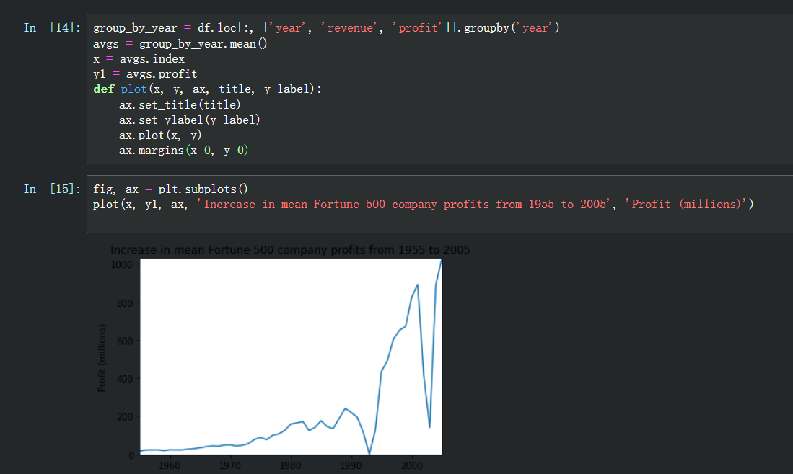

看起来像指数增长，但是1990年代初期出现急剧的下滑，对应当时经济衰退和网络泡沫。再来看看收入曲线。

```python
y2 = avgs.revenue
fig, ax = plt.subplots()
plot(x, y2, ax, 'Increase in mean Fortune 500 company revenues from 1955 to 2005', 'Revenue (millions)')

```

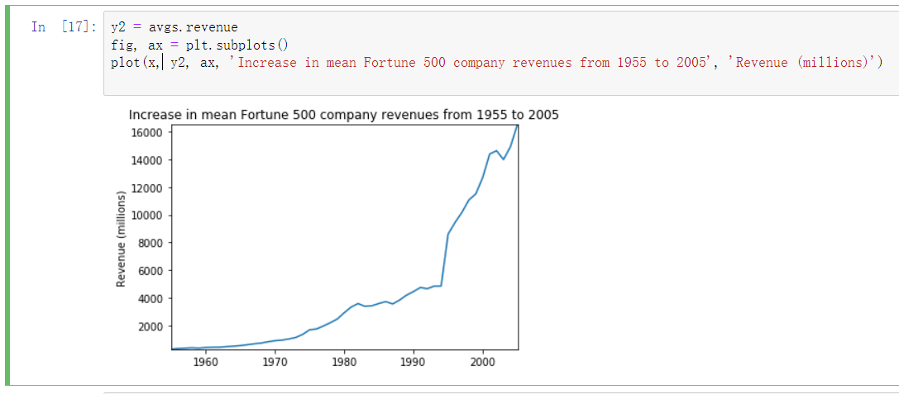

公司收入曲线并没有出现急剧下降，可能是由于财务会计的处理。对数据结果进行标准差处理。

```python
def plot_with_std(x, y, stds, ax, title, y_label):
    ax.fill_between(x, y - stds, y + stds, alpha=0.2)
    plot(x, y, ax, title, y_label)
fig, (ax1, ax2) = plt.subplots(ncols=2)
title = 'Increase in mean and std Fortune 500 company %s from 1955 to 2005'
stds1 = group_by_year.std().profit.values
stds2 = group_by_year.std().revenue.values
plot_with_std(x, y1.values, stds1, ax1, title % 'profits', 'Profit (millions)')
plot_with_std(x, y2.values, stds2, ax2, title % 'revenues', 'Revenue (millions)')
fig.set_size_inches(14, 4)
fig.tight_layout()

```

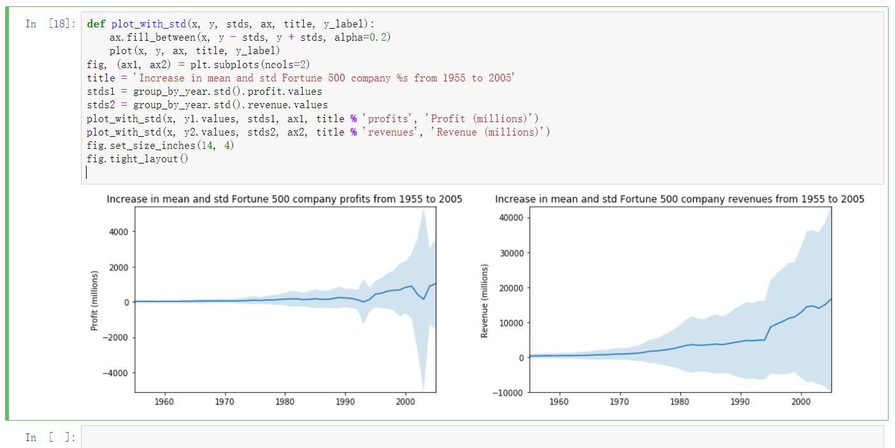

可见，不同公司之间的收入和利润差距惊人，那么到底前10%和后10%的公司谁的波动更大了？此外，还有很多有价值的信息值得进一步挖掘。

## 五、分享Notebooks

### 分享之前的工作

分享的Notebooks应包括代码执行的输出，要保证执行的结果符合预期，需完成以下几件事：

- 点击"Cell > All Output > Clear"
- 点击"Kernel > Restart & Run All"
- 等待所有代码执行完毕

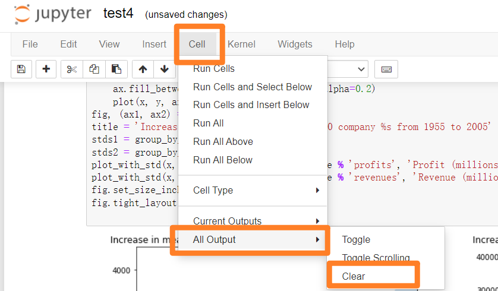


### 导出Notebooks

使用"File > Download as"可以以多种格式导出Notebooks，例如：html, pdf, markdown文档等。如果希望以协同方式共享.ipynb，则可以借助相关的在线平台，如[Github](https://github.com/)或者[Google Colab](https://colab.research.google.com/)。

### Jupyter Notebook扩展工具

Jupter Notebook的扩展工具(extensions)可以提供丰富的附加功能，例如代码补全、内容目录、变量检查等。本节演示如何安装扩展工具和启用代码补全功能。
首先Anaconda Navigator中启动命令行终端，


在弹出的终端中依次输入下面4条命令，注意要耐心等待命令执行完成。

```pip
pip install jupyter_contrib_nbextensions
jupyter contrib nbextension install --user
pip install jupyter_nbextensions_configurator
jupyter nbextensions_configurator enable --user
```

等待最后一条指令完成即可。完成之后，重新打开Jupyter Notebook启动页面，可以看到：

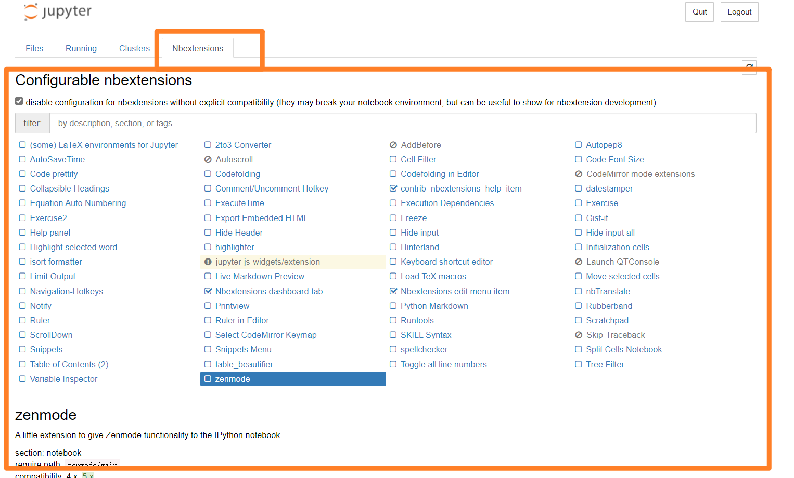

点击Nbextensions标签，勾选Hinterland：

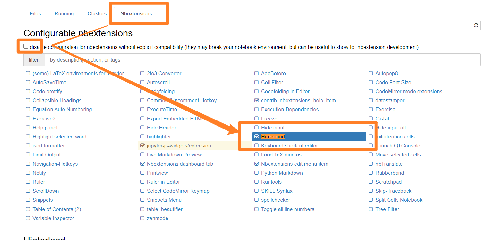

接下来可以在notebook进行验证，Tab健可以补全或者选择代码。


