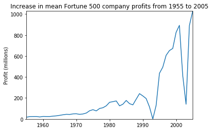
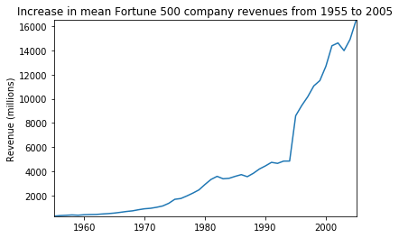

# Jupyter Notebook使用

## 快速排序的python实现


```python
def partition(arr,low,high): 
    i = ( low-1 )         # 最小元素索引
    pivot = arr[high]     
  
    for j in range(low , high): 
  
        # 当前元素小于或等于 pivot 
        if   arr[j] <= pivot: 
          
            i = i+1 
            arr[i],arr[j] = arr[j],arr[i] 
  
    arr[i+1],arr[high] = arr[high],arr[i+1] 
    return ( i+1 ) 
  
 
# arr[] --> 排序数组
# low  --> 起始索引
# high  --> 结束索引
  
# 快速排序函数
def quickSort(arr,low,high): 
    if low < high: 
  
        pi = partition(arr,low,high) 
  
        quickSort(arr, low, pi-1) 
        quickSort(arr, pi+1, high) 
  
arr = [10, 7, 8, 9, 1, 5] 
n = len(arr) 
quickSort(arr,0,n-1) 
print ("排序后的数组:") 
for i in range(n): 
    print("%d" %arr[i]),
```

    排序后的数组:
    1
    5
    7
    8
    9
    10


## 一、Jupyter Notebook简介

最好先安装Anaconda，Anaconda 中自带一个Jupyter的版本。

且使用Anaconda可以方便的安装python的一些包。

## 二、创建一个新的Notebook

新建一个Notebook Python 3 (ipykernel)，生成了一个`Untitled.ipynb`文件。`.ipynb`文件即所谓的一个Notebook，实际是基于JSON格式的文本文件，并且包含元数据(“Edit > Edit Notebook Metadata”)。新建的Notebook的界面大致如下：

**Kenel**

每个notebook都基于一个内核运行，当执行cell代码时，代码将在内核当中运行，运行的结果会显示在页面上。Kernel中运行的状态在整个文档中是延续的，可以跨越所有的cell。这意思着在一个Notebook某个cell定义的函数或者变量等，在其他cell也可以使用。

## 三、数据分析的例子

导入相关工具库：


```python
%matplotlib inline
import pandas as pd
import matplotlib.pyplot as plt
import seaborn as sns

```

加载数据集：
使用df.head()方法查看数据表的前5个元素：
使用df.tail()方法查看数据表的前5个元素：


```python
# 加载数据集
df = pd.read_csv('fortune500.csv')

```


```python
df.head()

```


<div>
<style scoped>
    .dataframe tbody tr th:only-of-type {
        vertical-align: middle;
    }

    .dataframe tbody tr th {
        vertical-align: top;
    }
    
    .dataframe thead th {
        text-align: right;
    }
</style>
<table border="1" class="dataframe">
  <thead>
    <tr style="text-align: right;">
      <th></th>
      <th>Year</th>
      <th>Rank</th>
      <th>Company</th>
      <th>Revenue (in millions)</th>
      <th>Profit (in millions)</th>
    </tr>
  </thead>
  <tbody>
    <tr>
      <th>0</th>
      <td>1955</td>
      <td>1</td>
      <td>General Motors</td>
      <td>9823.5</td>
      <td>806</td>
    </tr>
    <tr>
      <th>1</th>
      <td>1955</td>
      <td>2</td>
      <td>Exxon Mobil</td>
      <td>5661.4</td>
      <td>584.8</td>
    </tr>
    <tr>
      <th>2</th>
      <td>1955</td>
      <td>3</td>
      <td>U.S. Steel</td>
      <td>3250.4</td>
      <td>195.4</td>
    </tr>
    <tr>
      <th>3</th>
      <td>1955</td>
      <td>4</td>
      <td>General Electric</td>
      <td>2959.1</td>
      <td>212.6</td>
    </tr>
    <tr>
      <th>4</th>
      <td>1955</td>
      <td>5</td>
      <td>Esmark</td>
      <td>2510.8</td>
      <td>19.1</td>
    </tr>
  </tbody>
</table>
</div>


```python
df.tail()

```


<div>
<style scoped>
    .dataframe tbody tr th:only-of-type {
        vertical-align: middle;
    }

    .dataframe tbody tr th {
        vertical-align: top;
    }
    
    .dataframe thead th {
        text-align: right;
    }
</style>
<table border="1" class="dataframe">
  <thead>
    <tr style="text-align: right;">
      <th></th>
      <th>Year</th>
      <th>Rank</th>
      <th>Company</th>
      <th>Revenue (in millions)</th>
      <th>Profit (in millions)</th>
    </tr>
  </thead>
  <tbody>
    <tr>
      <th>25495</th>
      <td>2005</td>
      <td>496</td>
      <td>Wm. Wrigley Jr.</td>
      <td>3648.6</td>
      <td>493</td>
    </tr>
    <tr>
      <th>25496</th>
      <td>2005</td>
      <td>497</td>
      <td>Peabody Energy</td>
      <td>3631.6</td>
      <td>175.4</td>
    </tr>
    <tr>
      <th>25497</th>
      <td>2005</td>
      <td>498</td>
      <td>Wendy's International</td>
      <td>3630.4</td>
      <td>57.8</td>
    </tr>
    <tr>
      <th>25498</th>
      <td>2005</td>
      <td>499</td>
      <td>Kindred Healthcare</td>
      <td>3616.6</td>
      <td>70.6</td>
    </tr>
    <tr>
      <th>25499</th>
      <td>2005</td>
      <td>500</td>
      <td>Cincinnati Financial</td>
      <td>3614.0</td>
      <td>584</td>
    </tr>
  </tbody>
</table>
</div>


对数据属性列进行重命名，以便在后续访问


```python
df.columns = ['year', 'rank', 'company', 'revenue', 'profit']
```

接下来，检查数据条目是否加载完整, 检查属性列的类型。


```python
len(df)
```


    25500


接下来，检查数据条目是否加载完整, 检查属性列的类型。


```python
df.dtypes
```


    year         int64
    rank         int64
    company     object
    revenue    float64
    profit      object
    dtype: object


其他属性列都正常，但是对于profit属性，期望的结果是float类型，因此其可能包含非数字的值，利用正则表达式进行检查。


```python
non_numberic_profits = df.profit.str.contains('[^0-9.-]')
df.loc[non_numberic_profits].head()
```


<div>
<style scoped>
    .dataframe tbody tr th:only-of-type {
        vertical-align: middle;
    }

    .dataframe tbody tr th {
        vertical-align: top;
    }
    
    .dataframe thead th {
        text-align: right;
    }
</style>
<table border="1" class="dataframe">
  <thead>
    <tr style="text-align: right;">
      <th></th>
      <th>year</th>
      <th>rank</th>
      <th>company</th>
      <th>revenue</th>
      <th>profit</th>
    </tr>
  </thead>
  <tbody>
    <tr>
      <th>228</th>
      <td>1955</td>
      <td>229</td>
      <td>Norton</td>
      <td>135.0</td>
      <td>N.A.</td>
    </tr>
    <tr>
      <th>290</th>
      <td>1955</td>
      <td>291</td>
      <td>Schlitz Brewing</td>
      <td>100.0</td>
      <td>N.A.</td>
    </tr>
    <tr>
      <th>294</th>
      <td>1955</td>
      <td>295</td>
      <td>Pacific Vegetable Oil</td>
      <td>97.9</td>
      <td>N.A.</td>
    </tr>
    <tr>
      <th>296</th>
      <td>1955</td>
      <td>297</td>
      <td>Liebmann Breweries</td>
      <td>96.0</td>
      <td>N.A.</td>
    </tr>
    <tr>
      <th>352</th>
      <td>1955</td>
      <td>353</td>
      <td>Minneapolis-Moline</td>
      <td>77.4</td>
      <td>N.A.</td>
    </tr>
  </tbody>
</table>
</div>


确实存在这样的记录，profit这一列为字符串，统计一下到底存在多少条这样的记录。


```python
len(df.profit[non_numberic_profits])
```


    369


总体来说，利润（profit）列包含非数字的记录相对来说较少。更进一步，使用直方图显示一下按照年份的分布情况。


```python
bin_sizes, _, _ = plt.hist(df.year[non_numberic_profits], bins=range(1955, 2006))
```


可见，单独年份这样的记录数都少于25条，即少于4%的比例。这在可以接受的范围内，因此删除这些记录。


```python
df = df.loc[~non_numberic_profits]
df.profit = df.profit.apply(pd.to_numeric)

```

再次检查数据记录的条目数。


```python
len(df)
df.dtypes
```


    year         int64
    rank         int64
    company     object
    revenue    float64
    profit     float64
    dtype: object


## 四、使用matplotlib进行绘图

接下来，以年分组绘制平均利润和收入。首先定义变量和方法。


```python
group_by_year = df.loc[:, ['year', 'revenue', 'profit']].groupby('year')
avgs = group_by_year.mean()
x = avgs.index
y1 = avgs.profit
def plot(x, y, ax, title, y_label):
    ax.set_title(title)
    ax.set_ylabel(y_label)
    ax.plot(x, y)
    ax.margins(x=0, y=0)
```


```python
fig, ax = plt.subplots()
plot(x, y1, ax, 'Increase in mean Fortune 500 company profits from 1955 to 2005', 'Profit (millions)')

```





看起来像指数增长，但是1990年代初期出现急剧的下滑，对应当时经济衰退和网络泡沫。再来看看收入曲线。


```python
y2 = avgs.revenue
fig, ax = plt.subplots()
plot(x, y2, ax, 'Increase in mean Fortune 500 company revenues from 1955 to 2005', 'Revenue (millions)')

```





公司收入曲线并没有出现急剧下降，可能是由于财务会计的处理。对数据结果进行标准差处理。

可见，不同公司之间的收入和利润差距惊人，那么到底前10%和后10%的公司谁的波动更大了？此外，还有很多有价值的信息值得进一步挖掘。


```python
def plot_with_std(x, y, stds, ax, title, y_label):
    ax.fill_between(x, y - stds, y + stds, alpha=0.2)
    plot(x, y, ax, title, y_label)
fig, (ax1, ax2) = plt.subplots(ncols=2)
title = 'Increase in mean and std Fortune 500 company %s from 1955 to 2005'
stds1 = group_by_year.std().profit.values
stds2 = group_by_year.std().revenue.values
plot_with_std(x, y1.values, stds1, ax1, title % 'profits', 'Profit (millions)')
plot_with_std(x, y2.values, stds2, ax2, title % 'revenues', 'Revenue (millions)')
fig.set_size_inches(14, 4)
fig.tight_layout()

```


## 五、分享Notebooks

### 分享之前的工作

分享的Notebooks应包括代码执行的输出，要保证执行的结果符合预期，需完成以下几件事：

- 点击"Cell > All Output > Clear"
- 点击"Kernel > Restart & Run All"
- 等待所有代码执行完毕

### 导出Notebooks

使用"File > Download as"可以以多种格式导出Notebooks，例如：html, pdf, markdown文档等。如果希望以协同方式共享.ipynb，则可以借助相关的在线平台，如[Github](https://github.com/)或者[Google Colab](https://colab.research.google.com/)。

### Jupyter Notebook扩展工具

Jupter Notebook的扩展工具(extensions)可以提供丰富的附加功能，例如代码补全、内容目录、变量检查等。本节演示如何安装扩展工具和启用代码补全功能。
首先Anaconda Navigator中启动命令行终端，

在弹出的终端中依次输入下面4条命令，注意要耐心等待命令执行完成。


```python
pip install jupyter_contrib_nbextensions
jupyter contrib nbextension install --user
pip install jupyter_nbextensions_configurator
jupyter nbextensions_configurator enable --user
```


      File "<ipython-input-18-fbbe945445c2>", line 1
        pip install jupyter_contrib_nbextensions
                  ^
    SyntaxError: invalid syntax


等待最后一条指令完成即可。完成之后，重新打开Jupyter Notebook启动页面.<br />
点击Nbextensions标签，勾选Hinterland。<br />
接下来可以在notebook进行验证，Tab健可以补全或者选择代码。


```python
prin
```
